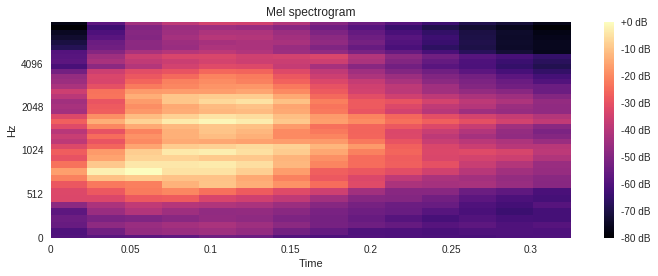

## Portfolio

## [Research: Assessing the Impact of Rights-Based Approaches to Food Security and Nutrition](/projects/rights_and_food_security_)

The United Nations Food and Agriculture Organization and the World Agroforestry Centre commissioned Polyculture Research to summarize the evedence that rights-based approaches to food security and nutrition work in a wide range of contexts. We coordinated a team of more than fifteen scientists to compile, screen, code, and analyze studies on food sovereignty and the right to food in the peer-reviewed and grey literature. Together, we accessed over 22,000 abstracts and read more than 1200 full texts. We used R to analyze and visualize the results. Key findings are that there is ample evidence from all parts of the world that government and NGO support for food sovereignty and the right to food can result in substantial increases in food security and nutrition. In the cases where a rights-based approaches do not result in increased food security, it is often beacuse the intervention is insuficient to overcome intersecting rights deficits and forms of opression.  

## [Practice Project: Identifying Urban Sounds with a Machine Learning Model]
(/projects/urban_sounds)

I'm a bit of an audiophile, and wanted to try my hand at machine learning using a neural netwrok model.  This common data science practice propblem uses a set of 4-second sound recordings that fall into ten catigories - jackhammer, children playing, gun shot, etc. The challenge is to train a model on a set of about 8,000 labeld sound files so that it can identify unlabeld sound files. I used the Librosa library in Python to extract frequency-based melodic eliments from the sound files, and then Keras/TensorFlow to make and train a neural network. I'm still refining the model by (A) evaluating and optomizing the hyperparamiters of the machine leanring model and (B) expiramenting with other data I can evaluate from the sound files. 
